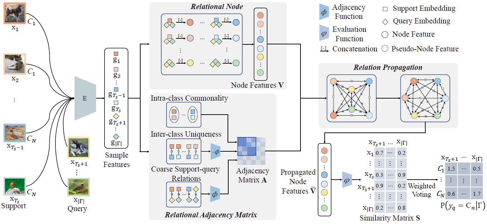

<h2 id="publications" style="margin: 2px 0px -15px;">Publications <temp style="font-size:15px;">[</temp><a href="https://scholar.google.com/citations?user=IKuBFE0AAAAJ" target="_blank" style="font-size:15px;">Google Scholar</a><temp style="font-size:15px;">]</temp></h2>

<ol class="bibliography">

<li>

  

    
            <abbr class="badge">IJCAI</abbr>
  

  

      
<a href="https://www.ijcai.org/proceedings/2020/0112.pdf">Transductive Relation-Propagation Network for Few-shot Learning</a>

      
Yuqing Ma, Shihao Bai, Shan An, <strong>Wei Liu</strong>, Aishan Liu, Xiantong Zhen, Xianglong Liu

      
<em>Proceedings of the Twenty-Ninth International Conference on International Joint Conferences on Artificial Intelligence<strong>(IJCAI)</strong>, 2020.</em>
      

    

      <a href="https://www.ijcai.org/proceedings/2020/0112.pdf" class="btn btn-sm z-depth-0" role="button" target="_blank" style="font-size:12px;">PDF</a>
      <a href="https://github.com/vickyFox/TRPN" class="btn btn-sm z-depth-0" role="button" target="_blank" style="font-size:12px;">Code</a>
      <a href="./../assets/bib_files/trpn.bib" class="btn btn-sm z-depth-0" role="button" target="_blank" style="font-size:12px;">BibTex</a> 
    

  

</li>
  
 

<li>

  

    
            <abbr class="badge">IJCAI</abbr>
  

  

      
<a href="https://www.ijcai.org/proceedings/2020/0112.pdf">Transductive Relation-Propagation Network for Few-shot Learning</a>

      
Yuqing Ma, Shihao Bai, Shan An, <strong>Wei Liu</strong>, Aishan Liu, Xiantong Zhen, Xianglong Liu

      
<em>Proceedings of the Twenty-Ninth International Conference on International Joint Conferences on Artificial Intelligence<strong>(IJCAI)</strong>, 2020.</em>
      

    

      <a href="https://www.ijcai.org/proceedings/2020/0112.pdf" class="btn btn-sm z-depth-0" role="button" target="_blank" style="font-size:12px;">PDF</a>
      <a href="https://github.com/vickyFox/TRPN" class="btn btn-sm z-depth-0" role="button" target="_blank" style="font-size:12px;">Code</a>
      <a href="./../assets/bib_files/trpn.bib" class="btn btn-sm z-depth-0" role="button" target="_blank" style="font-size:12px;">BibTex</a> 
    

  

</li>

</ol>

