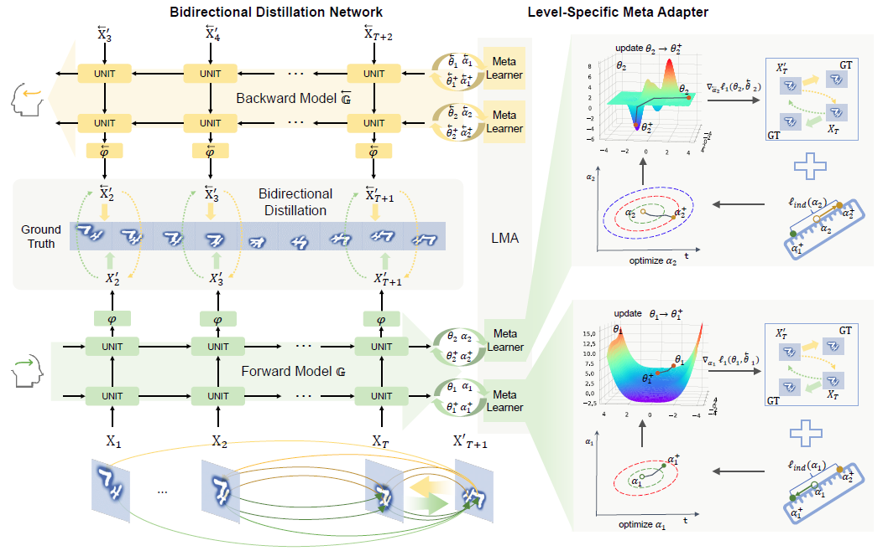
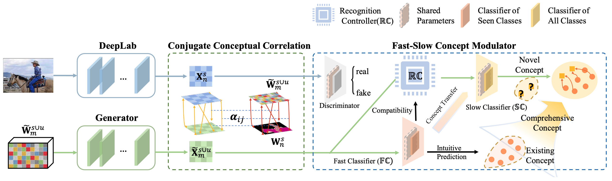
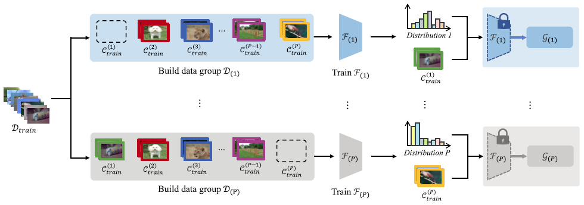
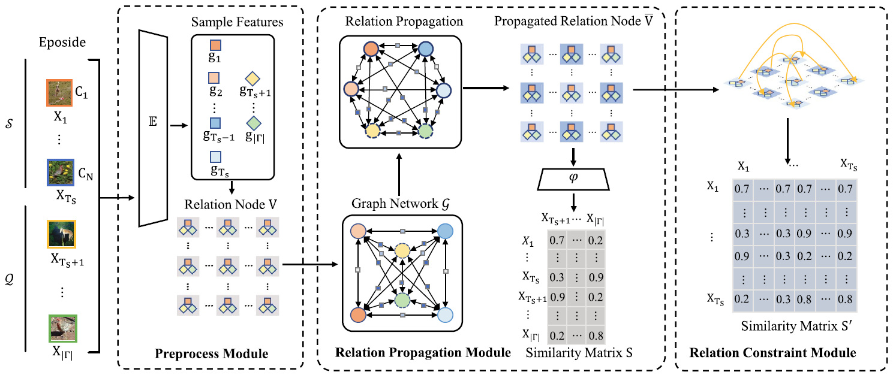
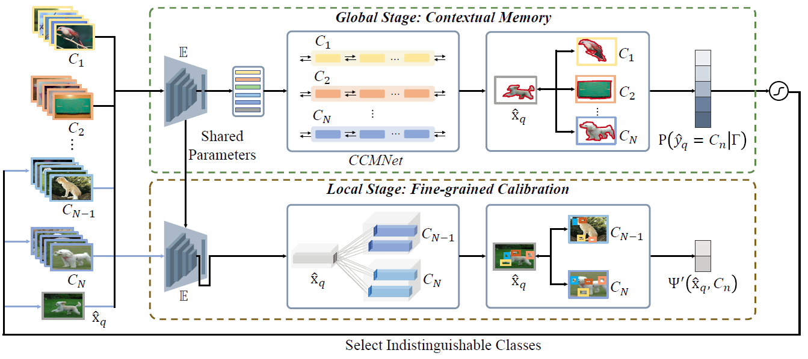
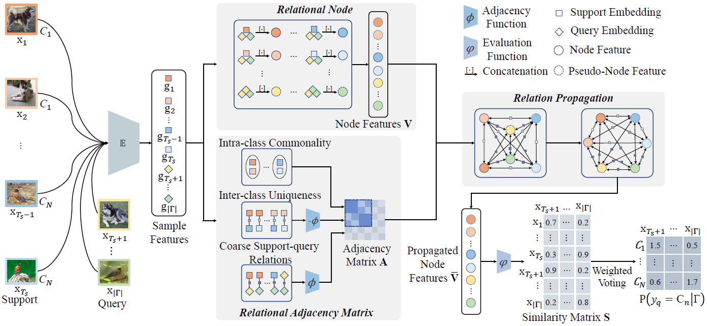

<h2 id="publications" style="margin: 2px 0px -15px;">Publications <temp style="font-size:15px;">[</temp><a href="https://scholar.google.com/citations?user=IKuBFE0AAAAJ" target="_blank" style="font-size:15px;">Google Scholar</a><temp style="font-size:15px;">]</temp></h2>

<ol class="bibliography">

<li>

  

    
            <abbr class="badge">SCIS</abbr>
  

  

      
SeeMore: a spatio-temporal predictive model with bidirectional distillation and level-specific meta adaptation

      
Yuqing Ma, <strong>Wei Liu</strong>, Yajun Gao, Yang Yuan, Shihao Bai, Haotong Qin, Xianglong Liu

      
<em>SCIENCE CHINA Information Sciences <strong>(SCIS)</strong>, 2023.</em>
      

    

      <!-- <a href="" class="btn btn-sm z-depth-0" role="button" target="_blank" style="font-size:12px;">PDF</a> -->
      <a href="https://github.com/DIG-Beihang/SeeMore" class="btn btn-sm z-depth-0" role="button" target="_blank" style="font-size:12px;">Code</a>
      <!-- <a href="./../assets/bib_files/" class="btn btn-sm z-depth-0" role="button" target="_blank" style="font-size:12px;">BibTex</a> -->
    

  

</li>

 

<li>

  

    
            <abbr class="badge">SCIS</abbr>
  

  

      
<a href="https://www.sciengine.com/SCIS/doi/10.1007/s11432-022-3748-5">A Meaningful Learning Method for Zero-shot Semantic Segmentation</a>

      
Xianglong Liu, Shihao Bai, Shan An, Shuo Wang, <strong>Wei Liu</strong>, Xiaowei Zhao, Yuqing Ma

      
<em>SCIENCE CHINA Information Sciences <strong>(SCIS)</strong>, 2023.</em>
      

    

      <a href="https://www.sciengine.com/doi/pdf/EEA10B752CEB45759ABF20C7612DF36B" class="btn btn-sm z-depth-0" role="button" target="_blank" style="font-size:12px;">PDF</a>
      <!-- <a href="" class="btn btn-sm z-depth-0" role="button" target="_blank" style="font-size:12px;">Code</a> -->
      <a href="./../assets/bib_files/MLM.bib" class="btn btn-sm z-depth-0" role="button" target="_blank" style="font-size:12px;">BibTex</a>
    

  

</li>

 

<li>

  

    
            <abbr class="badge">TNNLS</abbr>
  

  

      
<a href="https://ieeexplore.ieee.org/abstract/document/9459451">Transductive relation-propagation with decoupling training for few-shot learning</a>

      
Yuqing Ma, Shihao Bai, <strong>Wei Liu</strong>, Shuo Wang, Yue Yu, Xiao Bai, Xianglong Liu, Meng Wang

      
<em>IEEE transactions on neural networks and learning systems <strong>(TNNLS)</strong>, Volume 33, Number 11, 2022.</em>
      

    

      <a href="./../assets/pdf_files/TRPN-D.pdf" class="btn btn-sm z-depth-0" role="button" target="_blank" style="font-size:12px;">PDF</a>
      <a href="https://github.com/vickyFox/TRPN" class="btn btn-sm z-depth-0" role="button" target="_blank" style="font-size:12px;">Code</a>
      <a href="./../assets/bib_files/TRPN-D.bib" class="btn btn-sm z-depth-0" role="button" target="_blank" style="font-size:12px;">BibTex</a> 
    

  

</li>

 

<li>

  

    
            <abbr class="badge">IET CV</abbr>
  

  

      
<a href="https://ietresearch.onlinelibrary.wiley.com/doi/10.1049/cvi2.12074">Few-shot learning with relation propagation and constraint</a>

      
Huiyun Gong, Shuo Wang, Xiaowei Zhao, Yifan Yan, Yuqing Ma, <strong>Wei Liu</strong>, Xianglong Liu

      
<em>IET Computer Vision <strong>(IET CV)</strong>, Volume 15, Number 8, 2021.</em>
      

    

      <a href="https://ietresearch.onlinelibrary.wiley.com/doi/pdf/10.1049/cvi2.12074" class="btn btn-sm z-depth-0" role="button" target="_blank" style="font-size:12px;">PDF</a>
      <!-- <a href="" class="btn btn-sm z-depth-0" role="button" target="_blank" style="font-size:12px;">Code</a> -->
      <a href="./../assets/bib_files/CRPN.bib" class="btn btn-sm z-depth-0" role="button" target="_blank" style="font-size:12px;">BibTex</a>
    

  

</li>

 

<li>

  

    
            <abbr class="badge">IJCAI</abbr>
  

  

      
<a href="https://www.ijcai.org/proceedings/2020/0113.pdf">Few-shot Visual Learning with Contextual Memory and Fine-grained Calibration</a>

      
Yuqing Ma, <strong>Wei Liu</strong>, Shihao Bai, Qingyu Zhang, Aishan Liu, Weimin Chen, Xianglong Liu

      
<em>Proceedings of the Twenty-Ninth International Conference on International Joint Conferences on Artificial Intelligence <strong>(IJCAI)</strong>, 2020.</em>
      

    

      <a href="https://www.ijcai.org/proceedings/2020/0113.pdf" class="btn btn-sm z-depth-0" role="button" target="_blank" style="font-size:12px;">PDF</a>
      <a href="https://github.com/vickyFox/IPN" class="btn btn-sm z-depth-0" role="button" target="_blank" style="font-size:12px;">Code</a>
      <a href="./../assets/bib_files/IPN.bib" class="btn btn-sm z-depth-0" role="button" target="_blank" style="font-size:12px;">BibTex</a>
    

  

</li>

 

<li>

  

    
            <abbr class="badge">IJCAI</abbr>
  

  

      
<a href="https://www.ijcai.org/proceedings/2020/0112.pdf">Transductive Relation-Propagation Network for Few-shot Learning</a>

      
Yuqing Ma, Shihao Bai, Shan An, <strong>Wei Liu</strong>, Aishan Liu, Xiantong Zhen, Xianglong Liu

      
<em>Proceedings of the Twenty-Ninth International Conference on International Joint Conferences on Artificial Intelligence <strong>(IJCAI)</strong>, 2020.</em>
      

    

      <a href="https://www.ijcai.org/proceedings/2020/0112.pdf" class="btn btn-sm z-depth-0" role="button" target="_blank" style="font-size:12px;">PDF</a>
      <a href="https://github.com/vickyFox/TRPN" class="btn btn-sm z-depth-0" role="button" target="_blank" style="font-size:12px;">Code</a>
      <a href="./../assets/bib_files/TRPN.bib" class="btn btn-sm z-depth-0" role="button" target="_blank" style="font-size:12px;">BibTex</a>
    

  

</li>

</ol>

